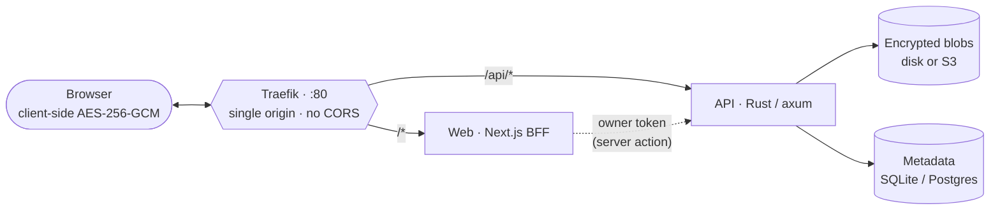

# share·me

Self-hostable, end-to-end-encrypted file & text sharing — a privacy-first drop service. Files and text are encrypted **in your browser** with AES-256-GCM before anything leaves the device; the decryption key lives only in the URL `#` fragment (or is derived from a password) and never reaches the server. No accounts, no tracking.

[](./LICENSE) [](https://github.com/onokashino/share-me)

## Features

- **Zero-knowledge** — AES-256-GCM streaming encryption in the browser; the server only ever stores ciphertext (filenames included).
- **Key in the link** — the master key sits in the URL fragment (`#k=…`), which browsers never send to servers. Optional password mode derives the key with Argon2id (PBKDF2 fallback) and is never transmitted.
- **Self-destructing** — link lifetime (expiry), download limit, burn-after-reading, and time-lock (unlock-at).
- **Files or text** — drag-and-drop, in-browser image/PDF preview, ZIP download of multiple files.
- **My links** — device-local history with live status, copy, revoke, and remove.
- **Polished UX** — i18n (EN / RU / 繁), onboarding tour, fully responsive, strict per-request nonce CSP, **zero external requests** (Tor-ready).
- **Storage** — local disk **or** any S3-compatible backend (MinIO, AWS S3, …).

## Architecture



- **API** (`apps/api`) — Rust (axum 0.8, sqlx, object_store). Stores encrypted blobs + metadata, enforces expiry/limits/time-lock, per-IP rate limiting. Owner/upload/download tokens are kept distinct.
- **Web** (`apps/web`) — Next.js 16 (React 19, Tailwind v4). All crypto runs client-side; a thin BFF (Server Actions) holds the per-drop owner token in an httpOnly cookie. Large blobs stream browser ↔ API directly.
- **Crypto** (`packages/crypto`) — the audited `@share-me/crypto` package (segmented AES-256-GCM STREAM, HKDF sub-keys, key-committing header).
- **Traefik** — single entrypoint so the browser talks to web and API on one origin (no CORS); `/api` goes straight to the API, off the Next.js path.

## Quick start (Docker)

Requirements: Docker + Docker Compose.

```bash
git clone https://github.com/onokashino/share-me.git && cd share-me
cp .env.example .env          # optional — defaults work out of the box
docker compose up --build
```

Open **http://localhost** and start sharing. Storage is local disk on the `api-data` named volume (SQLite metadata + encrypted blobs).

Stop with `docker compose down` (add `-v` to also wipe stored data).

### Run from prebuilt images (no local build)

CI publishes the images to the **GitHub Container Registry** (`ghcr.io`), so a server can skip the (RAM-hungry) build:

```bash
docker compose pull        # ghcr.io/onokashino/share-me-web + …-api
docker compose up -d
```

Images: [`ghcr.io/onokashino/share-me-web`](https://github.com/onokashino/share-me/pkgs/container/share-me-web) and [`ghcr.io/onokashino/share-me-api`](https://github.com/onokashino/share-me/pkgs/container/share-me-api) — `:latest` tracks the default branch, `:<short-sha>` per commit, `:1.2.3` on `v*` tags. Pin or swap them via `WEB_IMAGE` / `API_IMAGE` in `.env`. The workflow (`.github/workflows/docker-publish.yml`) pushes with the built-in `GITHUB_TOKEN` — **no secrets to configure**, forks work out of the box. (The first run publishes the packages *private*; make them public once under GitHub → your profile → **Packages**.)

### Public deployment — IP or domain + HTTPS

Out of the box the stack serves plain **HTTP** — reach it by the server's IP (or `http://localhost`). For a public site, point a domain at the server and Traefik fetches a free **Let's Encrypt** certificate automatically. In `.env`:

```bash
DOMAIN=share.example.com
ACME_EMAIL=you@example.com
PUBLIC_BASE_URL=https://share.example.com
```

First create the domain's **A/AAAA record** pointing at the server and open ports **80 + 443**, then `docker compose up -d`. The certificate is issued on the first request and persisted in the `letsencrypt` volume (it survives restarts); `:80` redirects to `:443`. Leave `DOMAIN` empty to stay on HTTP-by-IP — fine for localhost or a trusted network.

### With S3 / MinIO

```bash
docker compose -f docker-compose.yml -f docker-compose.s3.yml up --build
```

Adds a MinIO service, creates the bucket, and points the API at it (`STORAGE_BACKEND=s3`). For a managed S3 bucket, set `S3_*` and `S3_ENDPOINT`/region in `.env` and drop the `minio`/`createbucket` services.

## Configuration

All configuration is via environment variables (12-factor, fail-fast on invalid config). Common keys:

| Variable | Default | Purpose |
|---|---|---|
| `PUBLIC_BASE_URL` | `http://localhost` | Public origin the app is served from (**required**). |
| `HTTP_PORT` | `80` | Host port for the Traefik entrypoint. |
| `STORAGE_BACKEND` | `local` | `local` or `s3`. |
| `STORAGE_LOCAL_PATH` | `data/blobs` | Blob directory for the local backend (on the `api-data` volume). |
| `DATABASE_URL` | `sqlite://data/share-me.db` | SQLite path or `postgres://…`. |
| `DEFAULT_EXPIRY_SECS` / `MAX_EXPIRY_SECS` | 7d / 30d | Link lifetime default and cap. |
| `MAX_DOWNLOADS_CAP` | — | Optional hard cap on the per-link download limit. |
| `MAX_FILE_SIZE` | `5368709120` (5 GiB) | Max ciphertext size in bytes (files & text); `0` = unlimited. |
| `RATE_LIMIT_PER_SEC` / `RATE_LIMIT_BURST` | 50 / 40 | Per-IP API rate limit. |
| `REQUIRE_UPLOAD_PASSWORD` | `false` | Force password mode for all drops. |
| `S3_ENDPOINT` / `S3_REGION` / `S3_BUCKET` / `S3_ACCESS_KEY` / `S3_SECRET_KEY` | — | S3 backend (required when `STORAGE_BACKEND=s3`). |
| `NEXT_PUBLIC_TOR_URL` | — | Optional `.onion` mirror (build-time, web) — shows the Tor chip when set. |
| `NEXT_PUBLIC_SOURCE_URL` | canonical repo | "Source" link shown in the UI (build-time, web). Set this when you run a modified fork (AGPL §13). |

## Local development

```bash
npm install                                   # root install (workspaces)

# Terminal 1 — API:
cd apps/api && PUBLIC_BASE_URL=http://localhost:3000 cargo run

# Terminal 2 — web (dev server proxies /api → :8080):
cd apps/web && API_PUBLIC_URL=http://localhost:8080 API_INTERNAL_URL=http://localhost:8080 npm run dev
```

Web on http://localhost:3000. Tests: `cargo test` (API), `npm test -w web`, `npm test -w @share-me/crypto`.

## Hosting & support

share·me is one small Rust service plus a Next.js app, so it runs comfortably on a cheap VPS — **1 vCPU / 1 GB RAM** is plenty to *run* a personal instance or demo. The real constraints are **disk + bandwidth**, not CPU/RAM: the server streams blobs and never buffers whole files in memory.

> **Building** the images compiles Rust and wants **~2 GB RAM**. On a 1 GB box either build the images elsewhere / in CI and `docker pull` them, or add swap before `docker compose up --build`.

The public demo runs on **[ITLDC](https://itldc.com/?from=121542)** — NVMe cloud VPS from €3.99/mo across 20+ EU & US locations. Spinning up your own through that link credits the demo's account and helps keep it online.

[](https://itldc.com/?from=121542)

<!--
  Richer ITLDC banner: grab the personalised embed from your ITLDC partner portal
  (Promotional materials) and paste it right here.
  Keep banners/badges in this README ONLY — never in the app UI, which must stay
  zero-external-request and Tor-friendly (it never loads third-party images).
-->

### Donate

If share·me is useful to you, a tip helps keep the public demo online:

| Coin | Address |
|---|---|
| **BTC** | `bc1qd3js4ay2zgu8hr4e043w8639qpvkagm6pxwvfm` |
| **ETH · BSC** (EVM) | `0x7539f90b93d0a11923A704ECF6395BD16dEF9664` |
| **TRON** (TRX) | `TKDoDgpwdrQCrZ9sFuKCbJSQiWu89jv4hR` |
| **SOL** | `6btvbP2gniCyAaMeNMcqxK4Td6ovsEBAMo52RVtH3Wv9` |

## Security model

The server is untrusted by design: it sees only ciphertext and encrypted metadata. The master key is generated in the browser and placed in the URL fragment, which browsers never transmit. Password-protected links derive the key client-side; a wrong password fails server-side authorization (rate-limited) with no offline brute-force surface.

> **TLS:** the key travels in the URL fragment, so any public deployment must be HTTPS. Set `DOMAIN` + `ACME_EMAIL` in `.env` and Traefik provisions a Let's Encrypt certificate automatically — the plain HTTP / IP mode is for localhost or trusted networks only.

## License

share·me is licensed under the **GNU Affero General Public License v3.0** (AGPL-3.0) — see [LICENSE](./LICENSE). You are free to use, modify, and self-host it; but if you run a modified version as a network service, you must offer your users the corresponding source (AGPL §13).
